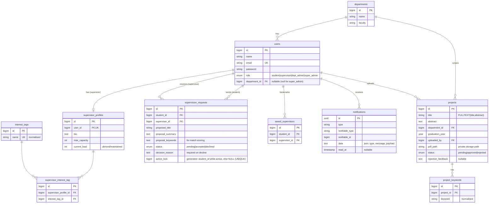

# Database Schema & ER Diagram

Relational schema (MySQL/MariaDB) for the FYP Repository & Supervisor Matching
platform. All tables are created via Laravel migrations in
`backend/database/migrations`.

## Entity–Relationship Diagram

## Tables

| Table | Purpose | Key columns / constraints |
|---|---|---|
| `departments` | Departments grouped under a faculty | unique `(name, faculty)` |
| `users` | All accounts; one role each | `role` enum, `department_id` FK (nullable for super admin), `email` unique |
| `supervisor_profiles` | One-to-one extension of a supervisor user | `user_id` unique FK, `max_capacity`, `current_load` |
| `interest_tags` | Normalised research-interest tags | `name` unique |
| `supervisor_interest_tag` | M:N supervisors ↔ interest tags | unique `(supervisor_profile_id, interest_tag_id)` |
| `projects` | Uploaded FYPs + moderation state | `status` enum, `pdf_path` (private), **FULLTEXT** `(title, abstract)` |
| `project_keywords` | Normalised keywords per project | unique `(project_id, keyword)`; drives filters + duplicate indicator |
| `supervision_requests` | Supervision request workflow | `status` enum; **`active_lock`** generated column + unique index enforces one active (pending/accepted) request per student |
| `saved_supervisors` | Student bookmarks | unique `(student_id, supervisor_id)` |
| `notifications` | In-app notifications (Laravel database channel) | polymorphic `notifiable`, JSON `data` (`type`, `message`, `payload`), `read_at` |

## Notable integrity mechanisms

- **One active request per student** — a `STORED` generated column
  `active_lock = CASE WHEN status IN ('pending','accepted') THEN student_id ELSE NULL END`
  carries a `UNIQUE` index. MySQL allows many `NULL`s but only one non-null per
  student, so a student can hold at most one active request — race-safe even
  under concurrent submissions. Application code also checks this inside a
  transaction for a friendly error message.
- **Transactional capacity** — accepting a request increments
  `supervisor_profiles.current_load` under a row lock (`SELECT ... FOR UPDATE`)
  and refuses if it would exceed `max_capacity`.
- **Full-text search** — `MATCH(title, abstract) AGAINST (... IN NATURAL LANGUAGE MODE)`
  backs the repository free-text search.
